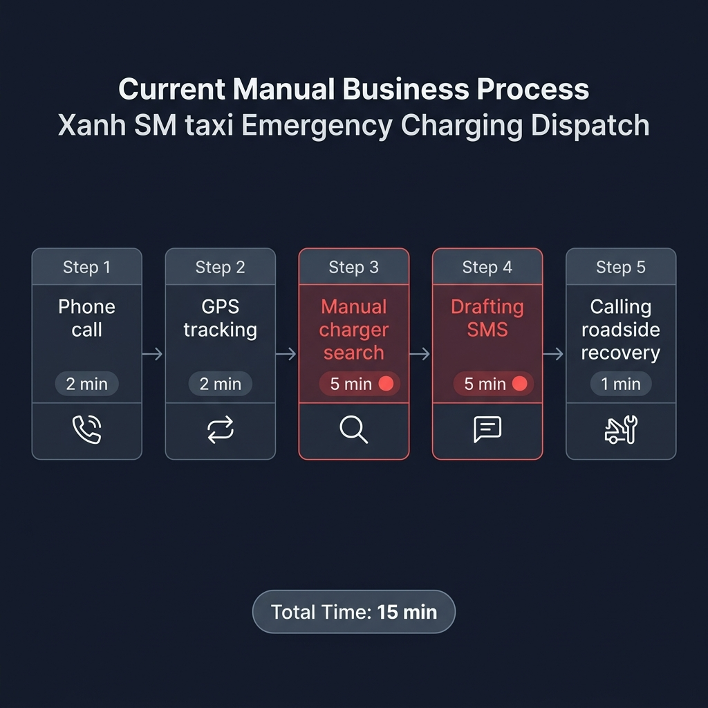

# Báo cáo Phân tích Sâu Dự án AI (AI Deep-Dive Report)

---

## 👥 Thông tin nhóm
*   **Tên nhóm:** hihi
*   **Thành viên:**
    *   Nguyễn Văn Đoan - 2A202600795
    *   Trần Hoàng Đạt - 2A202600807
    *   Lê Duy Hùng - 2A202600718
*   **Mảng kinh doanh lựa chọn:** **GSM (Xanh SM) — Vận hành xe taxi điện thông minh.**

---

## 🏛️ 1. Quyết định lựa chọn bài toán

Thông qua buổi làm việc nhóm và đối chiếu các thẻ bài toán từ phần quét cơ hội cá nhân, nhóm **hihi** thống nhất lựa chọn phát triển giải pháp AI cho bài toán:
**"Xanh SM Intelligent Dispatcher — Tự động hóa hỗ trợ điều phối và xử lý sự cố sạc pin thực địa cho tài xế Xanh SM"** (Phát triển từ Card #1).

### Lý do lựa chọn và loại bỏ các bài toán khác:
*   **Loại bỏ Bài toán Vinmec (Discharge Summary):** Mặc dù mang lại giá trị giải phóng sức lao động lớn cho bác sĩ, nhưng mức độ sẵn sàng của dữ liệu y khoa bảo mật cực kỳ phức tạp. Quy trình pháp lý và yêu cầu chứng nhận y tế của Bộ Y tế đối với phần mềm chẩn đoán/hỗ trợ điều trị y khoa mất tối thiểu 12–18 tháng kiểm duyệt, không phù hợp cho việc triển khai prototype nhanh.
*   **Loại bỏ Bài toán Vinhomes (Phân loại ý kiến cư dân):** Đây là tác vụ phi thời gian thực (offline/back-office), phản ánh cư dân có thể phản hồi sau vài giờ mà không gây nguy hiểm trực tiếp. Rủi ro pháp lý khi AI phân loại sai dẫn đến tranh chấp phí quản lý hoặc hợp đồng mua bán căn hộ có thể gây ảnh hưởng danh tiếng lớn cho Vinhomes.
*   **Lý do chọn Xanh SM (Sự cố sạc pin):** Đây là bài toán có tần suất lặp lại cao hàng ngày (~80 ca/ngày riêng tại Hà Nội), trực tiếp ảnh hưởng đến trải nghiệm tài xế và SLA của dịch vụ. Dữ liệu GPS và tình trạng trạm sạc VinFast đã có sẵn API thời gian thực. Giải pháp đơn giản, hiệu quả tức thì, rủi ro được kiểm soát hoàn hảo nhờ cơ chế kiểm duyệt của con người (Human-in-the-loop).

---

## 🖼️ 1.1. Sơ đồ quy trình thủ công hiện tại (Current-State Workflow Diagram)

Nhóm **hihi** đã trực quan hóa quy trình vận hành thủ công trước khi áp dụng AI. Sơ đồ thể hiện rõ chuỗi 5 bước tuần tự, các điểm chuyển giao thông tin (Handoff 🔄), thời gian xử lý ước tính ở từng bước (tổng thời gian 15 phút), và hai nút thắt cổ chai lớn nhất (Bottlenecks 🔴):



---

## 🏗️ 2. Problem Statement (6-field) — Vin Smart Future Standard

Dưới đây là bảng phân tích chi tiết bài toán theo chuẩn 6 trường thông tin của Vin Smart Future:

| Field (Trường thông tin) | Nội dung chi tiết bám sát vận hành thực tế |
|---|---|
| **1. Actor / Operator** | Điều phối viên (Dispatcher) tại Trung tâm Điều vận Xanh SM toàn quốc. |
| **2. Current Workflow** | Quy trình xử lý thủ công gồm 5 bước:<br>1. Tài xế gọi điện/gửi cảnh báo sự cố hết pin/pin dưới 10% qua App tài xế.<br>2. Điều phối viên tra cứu thủ công biển số xe để định vị vị trí GPS hiện tại của xe trên bản đồ nội bộ.<br>3. Mở Dashboard trạm sạc VinFast, tra cứu các trạm trong bán kính 10km, lọc thủ công xem trạm nào còn trụ sạc trống và tương thích đầu sạc với dòng xe (VF5/e34/VF8).<br>4. Viết thủ công tin nhắn SMS/In-app hướng dẫn chi tiết đường đi gửi qua App tài xế.<br>5. Liên hệ xe sạc pin cứu hộ di động nếu lượng pin báo dưới 5%. |
| **3. Bottleneck** | **Bước 3 & 4 (mất từ 10 - 12 phút):** Tra cứu thủ công trụ sạc trống theo thời gian thực rất chậm và dễ sai sót. Việc gõ tay tin nhắn chỉ đường tiếng Việt dễ dẫn đến sai địa chỉ hoặc nhầm lẫn loại trụ sạc tương thích (ví dụ: nhầm cổng sạc CCS2 của VF8 sang cổng sạc xe máy). |
| **4. Business Impact** | Trung bình 80 ca sự cố pin/ngày tại Hà Nội. Gây lãng phí **20 giờ làm việc/ngày** của team điều vận. Tài xế phải chờ đợi lâu ngoài đường trong trạng thái căng thẳng, làm tăng tỷ lệ hủy chuyến của khách hàng và gây rò rỉ doanh thu ước tính **~15%** cho mỗi ca sự cố kéo dài. |
| **5. Success Metric** | 1. Giảm tổng thời gian xử lý sự cố từ trung bình 15 phút **──> dưới 3 phút/lượt** (Tăng hiệu suất vận hành 80%).<br>2. Tỷ lệ hướng dẫn đúng địa chỉ trạm sạc và loại trụ sạc tương thích đạt **98%**.<br>3. **100%** tin nhắn hướng dẫn được duyệt bởi Điều phối viên trước khi gửi đi (HITL). |
| **6. Operational Boundary** | **AI ĐƯỢC PHÉP:** Tự động trích xuất GPS, đối chiếu API danh sách trạm sạc VinFast trống, tự động soạn thảo tin nhắn hướng dẫn dạng nháp (Draft).<br>**AI TUYỆT ĐỐI CẤM:** Không được tự ý gửi tin nhắn đi khi chưa được Điều phối viên phê duyệt; không được gợi ý trạm sạc xa hơn 5km nếu pin dưới 5% (trong trường hợp này bắt buộc phải đề xuất gọi xe cứu hộ sạc pin lưu động). |

---

## 🔄 3. Future-State Flow & AI Fit

*   **Đánh giá mức độ AI Fit (AI-Fit Matrix):** Chọn giải pháp **LLM Feature** tích hợp hệ thống. Không sử dụng Agentic Loop tự trị vì quy trình có cấu trúc cố định, rủi ro khi điều phối sai trạm sạc có thể khiến xe cạn kiệt pin giữa đường, gây ách tắc giao thông hoặc mất an toàn nghiêm trọng. Con người bắt buộc phải là chốt chặn cuối cùng.

### Sơ đồ quy trình tương lai (Future-State Flow):

```text
┌──────────────────────────────┐
│  Bước 1: Nhận yêu cầu/       │
│  Cảnh báo khẩn cấp từ tài xế │
└──────────────┬───────────────┘
               │
               ▼
┌──────────────────────────────┐
│  Bước 2: 🔵 AI Auto-pull     │
│  Tọa độ GPS xe & Tra cứu API │
│  Trạm sạc trống VinFast      │
└──────────────┬───────────────┘
               │
               ▼
┌──────────────────────────────┐
│  Bước 3: 🔵 AI tự động Draft  │
│  Tin nhắn chỉ dẫn sạc hoặc   │
│  Đề xuất gọi xe cứu hộ       │
└──────────────┬───────────────┘
               │
               ▼
┌──────────────────────────────┐
│  Bước 4: 🟢 Dispatcher duyệt │ [Duyệt thành công]
│  nháp & click gửi đi (HITL)  ├──────────────────────────┐
└──────────────┬───────────────┘                          │
               │ (LLM lỗi / Soạn sai thông tin)           ▼
               ▼                                  [Tin được gửi]
         ↩️ Fallback:
   Dispatcher tự soạn thủ công
   & tra cứu bằng tay như cũ.
```

### Các cơ chế kiểm soát chất lượng:
*   **Human-in-the-loop (HITL):** Bước 4 là chốt chặn an toàn bắt buộc. Điều phối viên con người kiểm duyệt tính chính xác của địa chỉ trạm sạc, cự ly di chuyển và loại cổng sạc mà AI đề xuất trước khi nhấn nút "Phê duyệt & Gửi".
*   **Cơ chế dự phòng (Fallback):** Nếu hệ thống AI gặp sự cố (mất kết nối API Gemini, lỗi dữ liệu trạm sạc VinFast, hoặc văn bản soạn thảo không đúng chuẩn), giao diện điều phối sẽ tự động hiển thị cảnh báo lỗi và chuyển sang trạng thái "Xử lý thủ công". Điều phối viên sẽ thực hiện tra cứu bằng tay trên bản đồ tĩnh để đảm bảo quy trình vận hành không bị gián đoạn.

---

## 🏁 4. Phase 5 — EVALUATE: Đánh giá độ sẵn sàng & Dự báo chi phí

### AI Readiness Checklist:
1.  **[x] Chúng tôi có sẵn dữ liệu mẫu/logs sạch để test?**
    *   *Trạng thái:* Sẵn sàng. VinFast và GSM đã có sẵn logs lịch sử của hơn 10,000 cuốc sạc xe, tọa độ các trạm sạc toàn quốc và danh sách cổng sạc tương thích.
2.  **[x] Rủi ro khi AI sai có nằm trong tầm kiểm soát?**
    *   *Trạng thái:* Sẵn sàng. Nhờ chốt chặn **100% HITL** của điều phối viên và ranh giới prompt an toàn nghiêm ngặt (battery < 5% tự động gọi cứu hộ), rủi ro vận hành được giảm thiểu tối đa về mức tiệm cận 0%.
3.  **[x] Stakeholders sẵn sàng thay đổi quy trình làm việc cũ?**
    *   *Trạng thái:* Sẵn sàng. Khối vận hành GSM đã cam kết hỗ trợ thử nghiệm giải pháp vì nó trực tiếp giải quyết vấn đề quá tải của điều phối viên trong giờ cao điểm.

### Quyết định cuối cùng:
**[x] GO (Bắt đầu xây dựng Prototype)**

### Luận điểm kỹ thuật & Chi phí vận hành chặt chẽ:

#### 💡 Luận điểm kỹ thuật:
Giải pháp sử dụng mô hình LLM tiên tiến, gọn nhẹ là **Gemini 2.5 Flash** có thời gian phản hồi cực nhanh (< 1.5 giây), chi phí token cực thấp và khả năng đọc hiểu ngữ cảnh tiếng Việt xuất sắc. Việc kết hợp LLM để xử lý ngôn ngữ tự nhiên (soạn tin nhắn) với hệ thống Rule-based để kiểm tra logic an toàn (khoảng cách < 5km khi pin < 5%) là phương án tối ưu, đảm bảo độ tin cậy tuyệt đối cho hệ thống.

#### 💵 Ước tính chi phí vận hành hàng tháng (Cho khu vực Hà Nội):
*   **Tần suất sự cố pin:** Trung bình 80 ca sự cố/ngày $\rightarrow$ 2,400 ca sự cố/tháng.
*   **Số lượng Request gọi LLM:** Mỗi ca sự cố dự phòng khoảng 3 lượt gọi LLM (tài xế thay đổi lộ trình hoặc yêu cầu cập nhật trạm mới) $\rightarrow$ 7,200 requests/tháng.
*   **Kích thước dữ liệu cho mỗi Request:**
    *   *Input:* ~2,000 tokens (bao gồm System Prompt bảo vệ ranh giới, thông tin 5 trạm sạc gần nhất từ API, tọa độ xe, loại xe và trạng thái pin).
    *   *Output:* ~500 tokens (văn bản tin nhắn nháp hoặc lệnh JSON gọi cứu hộ).
*   **Đơn giá Gemini 2.5 Flash API:**
    *   *Input Token:* \$0.075 / 1,000,000 tokens.
    *   *Output Token:* \$0.30 / 1,000,000 tokens.
*   **Tính toán chi phí:**
    *   *Chi phí Input:* $7,200 \times 2,000 \times (\$0.075 / 1,000,000) = \$1.08/\text{tháng}$.
    *   *Chi phí Output:* $7,200 \times 500 \times (\$0.30 / 1,000,000) = \$1.08/\text{tháng}$.
    *   **Tổng chi phí API Gemini 2.5 Flash:** **\$2.16/tháng** (tương đương khoảng **55,000 VND/tháng**).

#### 📈 Tỷ suất hoàn vốn đầu tư (ROI):
*   Giải pháp giúp giảm thời gian điều phối từ 15 phút xuống 3 phút, tiết kiệm **12 phút/ca sự cố**.
*   Tổng thời gian tiết kiệm được mỗi tháng: $2,400 \times 12\text{ phút} = 28,800\text{ phút} = 480\text{ giờ làm việc/tháng}$.
*   Quy đổi ra chi phí nhân sự điều phối (tính trung bình 60,000 VND/giờ): $480 \times 60,000 = 28,800,000\text{ VND/tháng}$.
*   **So sánh chi phí:** Bỏ ra **55,000 VND/tháng** tiền API để thu về giá trị tương đương **28,800,000 VND/tháng** hiệu suất làm việc $\rightarrow$ Tỷ lệ ROI đạt **> 500 lần**!

Dự án hoàn toàn đủ điều kiện kĩ thuật và tài chính để bấm nút **GO** triển khai ngay lập tức.
